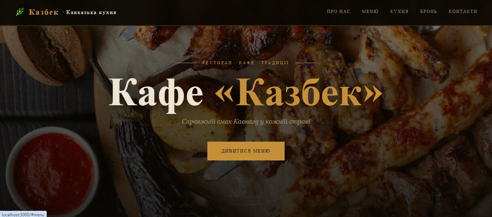

# 🌿 Кафе «Казбек» - MERN Stack Website

Повноцінний адаптивний сайт кавказького кафе на стеку **MongoDB+Express+React+Node.js**.

---

The project looks like:





## 📁 Структура проекту

````
kazbek/
├── package.json # Root — запуск dev/build
├── server/ # Backend (Node + Express + MongoDB)
│ ├── index.js # Точка входу
│ ├── config/db.js # Підключення до MongoDB
│ ├── models/
│ │ ├── MenuItem.js # Модель страви
│ │ └── Booking.js # Модель бронювання
│ ├── routes/
│ │ ├── menu.js # CRUD меню
│ │ └── bookings.js # Бронювання столів
│ ├── seed.js # Заповнення БД тестовими даними
│ └── .env.example # Приклад змінних оточення
└── client/ # Frontend (React) 
├── public/index.html 
└── src/ 
├── App.jsx 
├── index.css # Усі стилі 
├── api.js # Запити до API 
└── components/ 
├── Header.jsx # Шапка + бургер-меню 
├── Hero.jsx # Головний екран 
├── About.jsx # Про нас 
├── Menu.jsx # Меню (дані з API) 
├── ShashlikFeature.jsx # Секція шашлику 
├── Cuisine.jsx # Кавказька кухня 
├── Booking.jsx # Форма бронювання 
├── Contacts.jsx # Контакти + карта 
└── Footer.jsx # Підвал
````

---

## 🚀 Швидкий старт

### 1. Вимоги
- **Node.js** ≥ 18
- **MongoDB** — локально або [MongoDB Atlas](https://www.mongodb.com/atlas) (безкоштовно)

### 2. Встановлення

``` bash
# Клонуйте або розпакуйте проект
cd kazbek

# Встановити всі залежності (root + server + client)
npm run install-all
````

### 3. Налаштування оточення

``` bash
cd server
cp .env.example .env
````

Відредагуйте `server/.env`:
````
PORT=5000
MONGODB_URI=mongodb://localhost:27017/kazbek
````

> Для **MongoDB Atlas** замініть URI на рядок підключення з панелі Atlas:
> `MONGODB_URI=mongodb+srv://<user>:<password>@cluster.mongodb.net/kazbek`

### 4. Заповнити базу даних меню

``` bash
npm run seed
# ✅ Seeded 18 menu items
````

### 5. Запуск у режимі розробки

``` bash
npm run dev
````

Відкриє одночасно:
- **Backend API**: http://localhost:5000
- **React App**: http://localhost:3000

---

## 🌐 API Endpoints

| Метод | URL | Опис |
|--------|----------------------|---------------------------------------|
| GET | /api/health | Перевірка сервера
| GET | /api/menu | Усі страви меню
| GET | /api/menu?type=Суп | Страви за категорією |
| GET | /api/menu/:id | Одна страва
| POST | /api/menu | Додати блюдо |
| PUT | /api/menu/:id | Оновити страву
| DELETE | /api/menu/:id | Видалити блюдо |
| POST | /api/bookings | Створити броню столу
| GET | /api/bookings | Усі броні |
| PATCH | /api/bookings/:id | Змінити статус броні

---

## 🏗 Продакшн збірка

``` bash
npm run build # Білд React → client/build/
npm start # Запуск тільки Node-сервера
````

---

## ✨ Функціональність сайту

- **Header** — фіксований, зменшується при скролі, анімація
- **Burger-меню** — адаптивне для мобільних пристроїв
- **Hero** - повноекранна секція з паралакс-ефектом
- **Про нас** - історія кафе, фото, картки з особливостями
- **Меню** - таблиця страв з фільтрацією, дані з MongoDB
- **Шашлик** — акцентна секція з фото та червоним тлом
- **Кавказька кухня** - 6 карток з описом традицій
- **Бронювання** — форма з відправкою на сервер та збереженням до MongoDB
- **Контакти** — адреса, телефони, годинник роботи + Google Maps
- **Footer** — лого, доставка від 300 ₴, контакти, навігація

---

## 📞 Контакти кафе (у коді)

- **Адреса**: вул. Шевченка, 42, Дніпро
- **Тіл**: +38 (067) 123-45-67 / +38 (093) 123-45-67
- **Email**: info@kazbek.cafe
- **Доставка**: від 300 ₴
